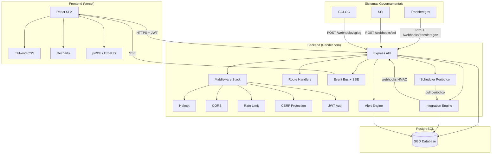
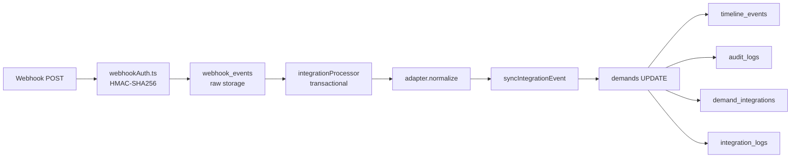
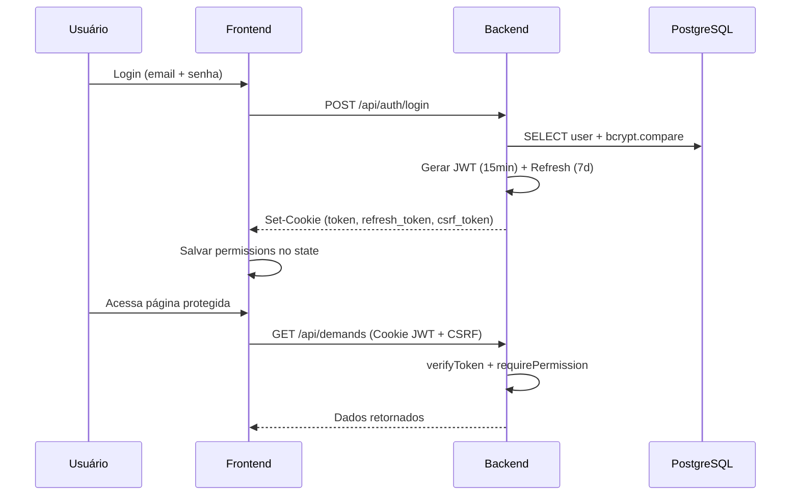
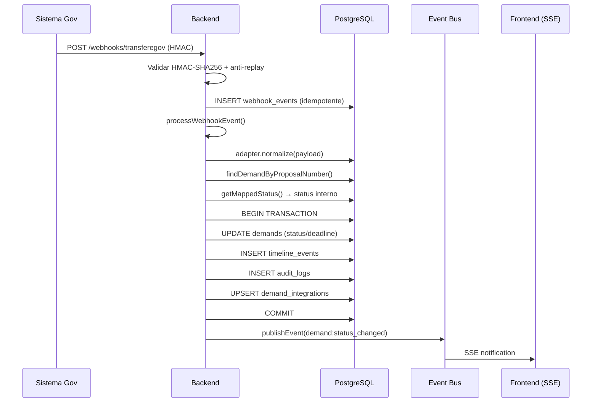
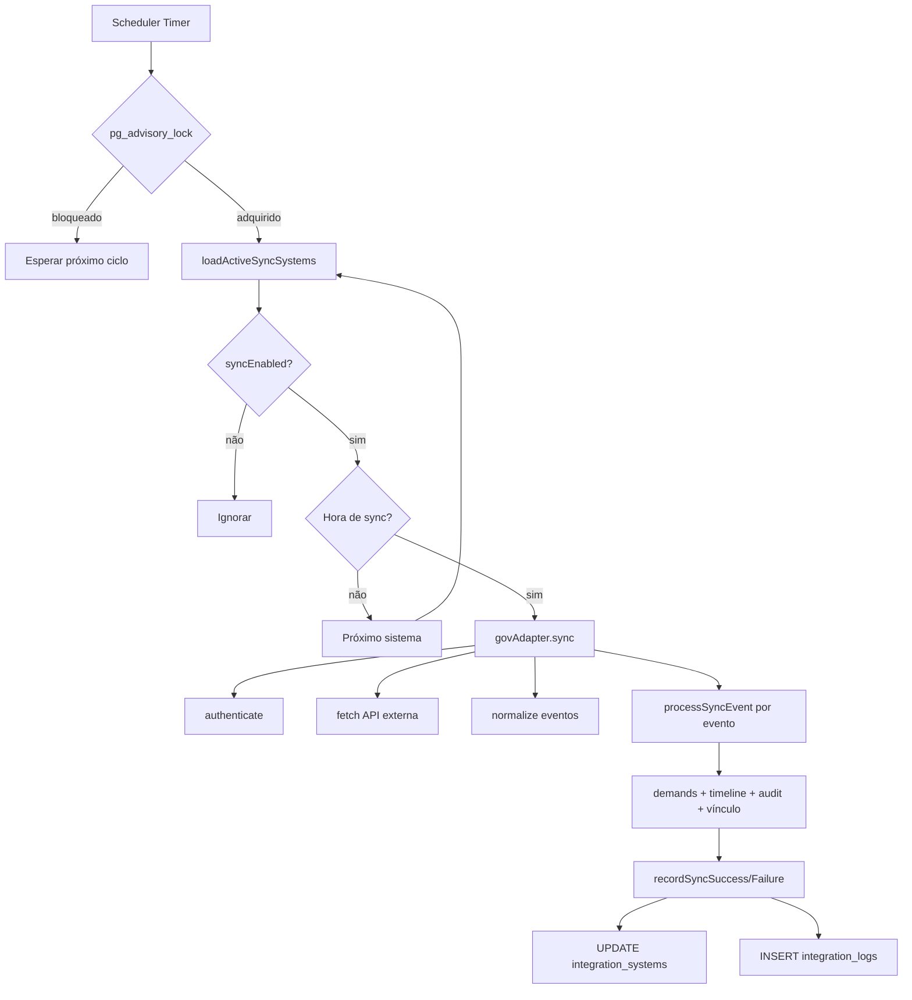

# Arquitetura Geral do SGD

Documento técnico oficial do **Sistema de Gestão de Demandas (SGD)** —
arquitetura, componentes, fluxos e decisões de design.

---

## 1. Visão Geral

O SGD é uma plataforma web para gestão de demandas de órgãos públicos
municipais, com integração governamental, auditoria completa, monitoramento
em tempo real e conformidade com LGPD.

### Stack Tecnológica

| Camada | Tecnologia | Versão |
|--------|-----------|--------|
| Frontend | React + TypeScript | 19.x |
| Estilo | Tailwind CSS | 4.x |
| Build | Vite | 6.x |
| Backend | Express + TypeScript | 4.21 / 5.7 |
| Banco | PostgreSQL | 16 |
| Deploy (frontend) | Vercel | — |
| Deploy (backend) | Render.com | — |

### Domínios

| Serviço | URL |
|---------|-----|
| Frontend (produção) | `https://gruposgd.com.br` |
| Backend API | `https://api.gruposgd.com.br/api` |
| Frontend (dev) | `http://localhost:3000` |
| Backend (dev) | `http://localhost:3001` |

---

## 2. Diagrama de Arquitetura



---

## 3. Componentes

### 3.1 Frontend (React SPA)

**Localização:** `frontend/src/`

| Pasta | Conteúdo |
|-------|----------|
| `components/views/` | Páginas principais (Dashboard, Demandas, Integrações, etc.) |
| `components/ui/` | Componentes reutilizáveis (Button, Table, Modal, Card, etc.) |
| `contexts/` | React Context (Auth, Toast) |
| `services/api.ts` | Cliente HTTP centralizado |
| `types.ts` | Tipagens TypeScript |
| `lib/` | Utilitários (formatação, config de integrações) |

**Princípios:**
- SPA com rotas client-side
- Componentes funcionais com hooks
- Tailwind CSS para estilização
- Tema claro/escuro
- Responsivo (mobile-first)

### 3.2 Backend (Express API)

**Localização:** `backend/src/`

| Pasta | Conteúdo |
|-------|----------|
| `routes/` | Handlers de rotas HTTP |
| `middleware/` | Auth, CSRF, webhook HMAC |
| `lib/` | Lógica de negócio, utilitários |
| `integrations/` | Adapters de sistemas governamentais |
| `__tests__/` | Testes automatizados (Vitest) |

**Ordem de middleware (server.ts):**
1. `helmet()` — headers de segurança
2. `compression()` — gzip (exclui SSE)
3. `cors()` — origin whitelist
4. Rate limiting (auth, API, webhooks)
5. `cookieParser()`
6. `express.raw()` — webhooks (body bruto para HMAC)
7. `express.json()` — body parsing
8. `csrfProtection` — exceto auth e webhooks

### 3.3 Banco de Dados

**Driver:** `pg` (node-postgres)
**Conexão:** `DATABASE_URL` (pool padrão, max 10 conexões)
**SSL:** produção com `DB_CA_CERT` ou `rejectUnauthorized: false`
**Migrações:** idempotentes via `initDatabase()` (CREATE TABLE IF NOT EXISTS)

**30 tabelas** organizadas em domínios:
- Demandas (demands, comments, timeline_events, attachments, demand_versions)
- Usuários (users, permissions, role_permissions, user_permissions)
- Integrações (integration_systems, webhook_events, integration_logs, demand_integrations)
- Segurança (token_blacklist, refresh_tokens, active_sessions, login_attempts)
- Operacional (audit_logs, monitoring_logs, backups, export_logs)

### 3.4 Integrações Governamentais

**Arquitetura em camadas:**



**Sistemas integrados:**
- **Transferegov** — transferências voluntárias (API key)
- **SEI** — processos eletrônicos (token)
- **CGLOG** — logs de acesso (token/OAuth2)

**Fluxo pull (scheduler):**
1. `integrationScheduler` seleciona sistemas ativos
2. `GovernmentIntegrationAdapter.sync()` executa autenticação + fetch
3. Normalização via adapter
4. Processamento via `processSyncEvent`
5. Persistência atômica com auditoria

---

## 4. Fluxos Principais

### 4.1 Autenticação



### 4.2 Webhook Governamental



### 4.3 Sincronização Periódica



---

## 5. Fluxo de Dados

### Demandas

```
demands
  ├── timeline_events (histórico de mudanças)
  ├── comments (observações)
  ├── attachments (arquivos)
  ├── demand_versions (snapshots)
  └── demand_integrations
        └── integration_systems (Transferegov/SEI/CGLOG)
```

### Integrações

```
webhook_events (evento bruto)
  └── integrationProcessor (processamento atômico)
        ├── demands (update status/prazo)
        ├── timeline_events (evento de integração)
        ├── audit_logs (rastreabilidade)
        ├── demand_integrations (vínculo)
        └── integration_logs (histórico operacional)
```

---

## 6. Inicialização do Servidor

A ordem de startup em `server.ts`:

1. `validateEnv()` — valida JWT_SECRET (≥32 chars), DATABASE_URL, CORS_ORIGIN
2. `initDatabase()` — cria/migra tabelas (idempotente)
3. `runSeed()` — dados iniciais (usuários, permissões, órgãos, sistemas)
4. `runCleanup()` — política de retenção (sessões 24h, logs 180d, etc.)
5. `startAlertScheduler()` — avaliação periódica de alertas (5 min)
6. `startIntegrationScheduler()` — sync periódica de integrações
7. `startPostgresListener()` — LISTEN/NOTIFY para SSE multi-instância
8. `startWebhookDispatcher()` — entrega assíncrona de webhooks outbound
9. `app.listen(PORT)` — inicia servidor (porta 3001)

### Graceful Shutdown

- SIGTERM/SIGINT → para schedulers e listeners, depois exit

---

## 7. Convenções de Código

- **TypeScript** estrito (strict mode)
- **ESM** (`"type": "module"` em package.json)
- **Vitest** para testes (626+ testes, ~34 arquivos)
- **Sem ORM** — queries SQL diretas via `pg`
- **Padrão de rotas:** arquivos em `routes/`, lógica em `lib/`
- **Testes:** arquivos `*.test.ts` em `__tests__/`
- **Variáveis de ambiente** para configuração (nunca hardcoded)
