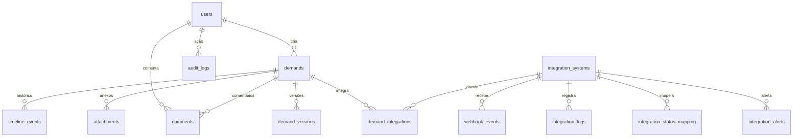

# Banco de Dados — SGD

Schema completo do banco de dados PostgreSQL do Sistema de Gestão de Demandas.

**Driver:** `pg` (node-postgres) | **Versão:** PostgreSQL 16 | **30 tabelas**

---

## 1. Visão Geral

---

## 2. Demandas (Core)

### demands

Entidade principal do sistema.

| Coluna | Tipo | Constraints | Descrição |
|--------|------|-------------|-----------|
| `id` | TEXT | PK | ID único (gerado: `DMN-{timestamp}`) |
| `title` | TEXT | NOT NULL | Título da demanda |
| `description` | TEXT | | Descrição detalhada |
| `category` | TEXT | | Categoria (EDUCAÇÃO, SAÚDE, etc.) |
| `municipality` | TEXT | NOT NULL | Município (capitalizado) |
| `uf` | TEXT(2) | NOT NULL | Unidade federativa |
| `status` | TEXT | NOT NULL, DEFAULT 'pendente' | Status da demanda |
| `priority` | TEXT | NOT NULL, DEFAULT 'media' | Prioridade |
| `organ` | TEXT | | Órgão responsável |
| `proposal_number` | TEXT | UNIQUE | Número da proposta (para integrações) |
| `created_at` | TIMESTAMPTZ | DEFAULT NOW() | Criação |
| `updated_at` | TIMESTAMPTZ | DEFAULT NOW() | Última atualização |
| `deleted_at` | TIMESTAMPTZ | | Soft delete |
| `tenant_id` | INTEGER | DEFAULT 1 | Multi-tenancy |

**Status válidos:** `analise`, `pendente`, `concluido`, `rejeitado`
**Prioridades:** `baixa`, `media`, `alta`, `urgente`

**Índices:** status, municipality, uf, created_at, tenant_id, deleted_at

### timeline_events

Histórico de mudanças em demandas.

| Coluna | Tipo | Descrição |
|--------|------|-----------|
| `id` | SERIAL PK | |
| `demand_id` | TEXT FK → demands | |
| `title` | TEXT | Título do evento |
| `description` | TEXT | Descrição detalhada |
| `user_name` | TEXT | Quem realizou |
| `new_status` | TEXT | Novo status (se aplicável) |
| `source` | TEXT | origem: `user`, `integration`, `system` |
| `metadata` | JSONB | Dados complementares |
| `created_at` | TIMESTAMPTZ | |

### attachments

Arquivos anexados a demandas.

| Coluna | Tipo | Descrição |
|--------|------|-----------|
| `id` | SERIAL PK | |
| `demand_id` | TEXT FK → demands | |
| `filename` | TEXT | Nome original |
| `file_hash` | TEXT | SHA-256 do conteúdo |
| `file_size` | INTEGER | Tamanho em bytes |
| `mime_type` | TEXT | Tipo MIME |
| `deleted_at` | TIMESTAMPTZ | Soft delete |

### comments

Comentários em demandas.

| Coluna | Tipo | Descrição |
|--------|------|-----------|
| `id` | SERIAL PK | |
| `demand_id` | TEXT FK → demands | |
| `user_id` | INTEGER FK → users | |
| `content` | TEXT | Conteúdo do comentário |
| `created_at` | TIMESTAMPTZ | |

### demand_versions

Snapshots de versões de demandas.

| Coluna | Tipo | Descrição |
|--------|------|-----------|
| `id` | SERIAL PK | |
| `demand_id` | TEXT FK → demands | |
| `version` | INTEGER | Número da versão |
| `data` | JSONB | Snapshot completo |
| `created_at` | TIMESTAMPTZ | |

---

## 3. Usuários e Permissões

### users

| Coluna | Tipo | Descrição |
|--------|------|-----------|
| `id` | SERIAL PK | |
| `email` | TEXT | UNIQUE, login |
| `password_hash` | TEXT | bcrypt hash |
| `name` | TEXT | Nome completo |
| `role` | TEXT | Papel do usuário |
| `active` | BOOLEAN | DEFAULT TRUE |
| `created_at` | TIMESTAMPTZ | |
| `deleted_at` | TIMESTAMPTZ | Soft delete |

**Roles:** admin, administrador, gestor, diretor, analista, tecnico, consulta, parceiro, cliente, visitante

### permissions

| Coluna | Tipo | Descrição |
|--------|------|-----------|
| `id` | SERIAL PK | |
| `key` | TEXT | UNIQUE (ex: `demands.view`) |
| `name` | TEXT | Nome amigável |
| `category` | TEXT | Agrupamento |
| `description` | TEXT | Descrição |

### role_permissions

Mapeamento papel → permissão padrão.

| Coluna | Tipo |
|--------|------|
| `role` | TEXT |
| `permission_id` | INTEGER FK → permissions |

### user_permissions

Permissões individuais (override do papel).

| Coluna | Tipo |
|--------|------|
| `user_id` | INTEGER FK → users |
| `permission_id` | INTEGER FK → permissions |
| `granted` | BOOLEAN |

### active_sessions

| Coluna | Tipo | Descrição |
|--------|------|-----------|
| `id` | SERIAL PK | |
| `user_id` | INTEGER FK → users | |
| `token_hash` | TEXT | SHA-256 do token |
| `ip_address` | TEXT | |
| `user_agent` | TEXT | |
| `expires_at` | TIMESTAMPTZ | |

### login_attempts

| Coluna | Tipo | Descrição |
|--------|------|-----------|
| `id` | SERIAL PK | |
| `email` | TEXT | |
| `ip_address` | TEXT | |
| `success` | BOOLEAN | |
| `created_at` | TIMESTAMPTZ | |

---

## 4. Integrações Governamentais

### integration_systems

Cadastro dos sistemas externos.

| Coluna | Tipo | Descrição |
|--------|------|-----------|
| `id` | SERIAL PK | |
| `code` | TEXT | UNIQUE (`transferegov`, `sei`, `cglog`) |
| `name` | TEXT | Nome amigável |
| `secret_env_key` | TEXT | Env var do secret |
| `config` | JSONB | Configuração (baseUrl, authType, etc.) |
| `active` | BOOLEAN | DEFAULT TRUE |
| `last_sync_at` | TIMESTAMPTZ | Último sync |
| `last_error_at` | TIMESTAMPTZ | Último erro |
| `last_error_message` | TEXT | Mensagem do erro |
| `last_http_status` | INTEGER | Último HTTP status |
| `last_response_ms` | INTEGER | Última latência |
| `error_count_24h` | INTEGER | Erros nas últimas 24h |
| `consecutive_errors` | INTEGER | Erros consecutivos |

### webhook_events

Eventos brutos recebidos (fonte de verdade da idempotência).

| Coluna | Tipo | Descrição |
|--------|------|-----------|
| `id` | SERIAL PK | |
| `system_id` | INTEGER FK | |
| `system_code` | TEXT | Cópia desnormalizada |
| `event_type` | TEXT | Tipo do evento |
| `idempotency_key` | TEXT | UNIQUE, deduplicação |
| `payload` | JSONB | Body parseado |
| `signature` | TEXT | X-Signature |
| `received_ip` | TEXT | IP de origem |
| `status` | TEXT | pending/processed/failed/unmatched/duplicate |
| `error` | TEXT | Mensagem de erro |
| `received_at` | TIMESTAMPTZ | |
| `processed_at` | TIMESTAMPTZ | |

### integration_logs

Histórico de operações.

| Coluna | Tipo | Descrição |
|--------|------|-----------|
| `id` | SERIAL PK | |
| `system_id` | INTEGER FK | |
| `system_code` | TEXT | |
| `direction` | TEXT | `in` (webhook) / `out` (sync) |
| `action` | TEXT | Tipo da operação |
| `demand_id` | TEXT | |
| `status` | TEXT | success/warning/error |
| `message` | TEXT | |
| `duration_ms` | INTEGER | |
| `http_status` | INTEGER | |
| `triggered_by` | TEXT | webhook/manual/scheduler |
| `error_message` | TEXT | |

### demand_integrations

Vínculo demanda × sistema externo.

| Coluna | Tipo | Descrição |
|--------|------|-----------|
| `id` | SERIAL PK | |
| `demand_id` | TEXT FK → demands | |
| `system_id` | INTEGER FK | |
| `external_id` | TEXT | ID externo (protocolo/processo) |
| `proposal_number` | TEXT | Número da proposta |
| `last_sync_at` | TIMESTAMPTZ | |
| `sync_status` | TEXT | none/pending/synced/error |
| `data` | JSONB | { changes, event_type } |

**Restrição:** `UNIQUE(demand_id, system_id)` → UPSERT

### integration_status_mapping

Mapeamento status externo → status interno.

| Coluna | Tipo | Descrição |
|--------|------|-----------|
| `id` | SERIAL PK | |
| `system_id` | INTEGER FK | |
| `external_status` | TEXT | CAIXA ALTA, sem acentos |
| `internal_status` | TEXT | analise/pendente/concluido/rejeitado |
| `active` | BOOLEAN | DEFAULT TRUE |

**Restrição:** `UNIQUE(system_id, external_status)`

### integration_alerts

Alertas inteligentes (R1–R10).

| Coluna | Tipo | Descrição |
|--------|------|-----------|
| `id` | SERIAL PK | |
| `system_id` | INTEGER FK | |
| `type` | TEXT | Tipo da regra |
| `severity` | TEXT | critical/warning/info |
| `status` | TEXT | open/acknowledged/resolved |
| `message` | TEXT | |
| `details` | JSONB | Dados da regra + ocorrências |
| `resolved_at` | TIMESTAMPTZ | |

**Dedup:** índice parcial UNIQUE `(system_id, type) WHERE status IN ('open','acknowledged')`

---

## 5. Observabilidade

### monitoring_logs

Snapshots periódicos de saúde.

| Coluna | Tipo | Descrição |
|--------|------|-----------|
| `server_cpu` | REAL | % |
| `server_memory` | REAL | % |
| `api_response_time` | INTEGER | ms |
| `db_connection_count` | INTEGER | |
| `active_users` | INTEGER | |
| `total_demands` | INTEGER | |
| `last_backup_at` | TIMESTAMPTZ | |
| `recorded_at` | TIMESTAMPTZ | |

### audit_logs

Trilha de auditoria completa.

| Coluna | Tipo | Descrição |
|--------|------|-----------|
| `id` | SERIAL PK | |
| `entity_type` | TEXT | demand / user / integration_system |
| `entity_id` | TEXT | ID da entidade |
| `action` | TEXT | Tipo da ação |
| `user_id` | INTEGER FK → users | |
| `user_name` | TEXT | |
| `details` | JSONB | Dados da ação |
| `_ip` | TEXT | IP do cliente |
| `_os` | TEXT | Sistema operacional |
| `_browser` | TEXT | Navegador |

### export_logs

Registro de exportações (PDF/Excel/CSV).

| Coluna | Tipo | Descrição |
|--------|------|-----------|
| `id` | SERIAL PK | |
| `user_id` | INTEGER FK | |
| `format` | TEXT | pdf/excel/csv |
| `record_count` | INTEGER | |
| `created_at` | TIMESTAMPTZ | |

### backups

Metadados de backups.

| Coluna | Tipo | Descrição |
|--------|------|-----------|
| `id` | SERIAL PK | |
| `filename` | TEXT | |
| `file_size` | INTEGER | |
| `file_hash` | TEXT | SHA-256 |
| `status` | TEXT | completed/failed |
| `created_at` | TIMESTAMPTZ | |

### background_jobs

Fila assíncrona de trabalhos em segundo plano (F2.2 — `lib/jobQueue.ts`).
Processamento distribuído com claim via `FOR UPDATE SKIP LOCKED`.

| Coluna | Tipo | Descrição |
|--------|------|-----------|
| `id` | SERIAL PK | |
| `queue` | TEXT | `default` |
| `type` | TEXT | Tipo do job (ex.: webhook_delivery) |
| `payload` | JSONB | Dados do job |
| `status` | TEXT | pending/running/retrying/succeeded/failed/cancelled |
| `attempts` | INTEGER | Tentativas realizadas |
| `max_attempts` | INTEGER | Limite de tentativas (padrão 3) |
| `next_run_at` | TIMESTAMPTZ | Agendamento com backoff exponencial + jitter |
| `last_error` | TEXT | Mensagem do último erro |
| `last_error_at` | TIMESTAMPTZ | |
| `locked_by` | TEXT | Identificação do worker (ownership distribuída) |
| `locked_at` | TIMESTAMPTZ | |
| `run_at` | TIMESTAMPTZ | Início da execução |
| `finished_at` | TIMESTAMPTZ | Fim da execução |
| `created_by` | INTEGER FK → users | Quem agendou (NULL = sistema) |
| `created_at` | TIMESTAMPTZ | |
| `updated_at` | TIMESTAMPTZ | |
| `tenant_id` | INTEGER | Multi-tenancy |

**Worker:** `startJobWorker()` em `lib/jobQueue.ts` — polling periódico (5s) com
processamento concorrente (padrão 3 jobs por ciclo) e limpeza de histórico.

---

## 6. Webhooks Outbound

### outbound_webhooks

Configuração de webhooks de saída.

| Coluna | Tipo | Descrição |
|--------|------|-----------|
| `id` | SERIAL PK | |
| `name` | TEXT | |
| `url` | TEXT | Endpoint destino |
| `events` | TEXT[] | Eventos que disparam |
| `secret` | TEXT | HMAC secret |
| `active` | BOOLEAN | |

### webhook_deliveries

Log de entregas.

| Coluna | Tipo | Descrição |
|--------|------|-----------|
| `id` | SERIAL PK | |
| `webhook_id` | INTEGER FK | |
| `event_type` | TEXT | |
| `payload` | JSONB | |
| `status` | TEXT | pending/delivered/failed |
| `attempts` | INTEGER | |
| `response_status` | INTEGER | |

---

## 7. Configurações

### system_settings

Singleton (id=1).

| Coluna | Tipo | Descrição |
|--------|------|-----------|
| `id` | INTEGER | PK, fixo = 1 |
| `sla_days_baixa` | INTEGER | SLA prioridade baixa |
| `sla_days_media` | INTEGER | SLA prioridade média |
| `sla_days_alta` | INTEGER | SLA prioridade alta |
| `sla_days_urgente` | INTEGER | SLA prioridade urgente |
| `auto_triage` | BOOLEAN | Triagem automática |
| `email_notifications` | BOOLEAN | Notificações por email |
| `budget_cap` | NUMERIC | Limite orçamentário |

### municipalities

Cadastro de municípios (validados via IBGE).

| Coluna | Tipo | Descrição |
|--------|------|-----------|
| `id` | SERIAL PK | |
| `name` | TEXT | Nome capitalizado |
| `uf` | TEXT(2) | |
| `ibge_code` | TEXT | Código IBGE |
| `schools_count` | INTEGER | |
| `population` | INTEGER | |
| `hdi` | REAL | IDHM |
| `region` | TEXT | Região geográfica |

**Restrição:** `UNIQUE(name, uf)`

### organs

Cadastro mestre de órgãos.

| Coluna | Tipo | Descrição |
|--------|------|-----------|
| `id` | SERIAL PK | |
| `name` | TEXT | UNIQUE, CAIXA ALTA |

---

## 8. Segurança (Tokens)

### token_blacklist

| Coluna | Tipo | Descrição |
|--------|------|-----------|
| `token_hash` | TEXT | SHA-256 |
| `expires_at` | TIMESTAMPTZ | |

### refresh_tokens

| Coluna | Tipo | Descrição |
|--------|------|-----------|
| `token_hash` | TEXT | SHA-256 |
| `user_id` | INTEGER FK | |
| `family` | TEXT | Rastreamento de rotação |
| `expires_at` | TIMESTAMPTZ | |

### password_reset_tokens

| Coluna | Tipo | Descrição |
|--------|------|-----------|
| `token_hash` | TEXT | SHA-256 |
| `user_id` | INTEGER FK | |
| `expires_at` | TIMESTAMPTZ | |

### password_history

| Coluna | Tipo | Descrição |
|--------|------|-----------|
| `user_id` | INTEGER FK | |
| `password_hash` | TEXT | Últimas 5 senhas |
| `created_at` | TIMESTAMPTZ | |

---

## 9. Multi-Tenancy

Coluna `tenant_id` (DEFAULT 1) presente em:
demands, users, municipalities, timeline_events, comments,
attachments, audit_logs, integration_systems, webhook_events,
integration_logs, demand_integrations, integration_alerts,
outbound_webhooks, webhook_deliveries, background_jobs

---

## 10. Índices Principais

| Tabela | Índice | Coluna(s) |
|--------|--------|-----------|
| demands | `idx_demands_status` | status |
| demands | `idx_demands_municipality` | municipality |
| demands | `idx_demands_created` | created_at |
| audit_logs | `idx_audit_entity` | (entity_type, entity_id) |
| audit_logs | `idx_audit_created` | created_at |
| timeline_events | `idx_timeline_demand` | demand_id |
| webhook_events | `idx_webhook_system` | system_id |
| webhook_events | `idx_webhook_status` | status |
| integration_logs | `idx_logs_system` | system_id |
| integration_alerts | `idx_alerts_system_status` | (system_id, status) |
| background_jobs | `idx_background_jobs_pickup` | (status, next_run_at) WHERE status IN ('pending','retrying') |
| background_jobs | `idx_background_jobs_queue` | queue |
| background_jobs | `idx_background_jobs_type` | type |
| background_jobs | `idx_background_jobs_created` | created_at |
